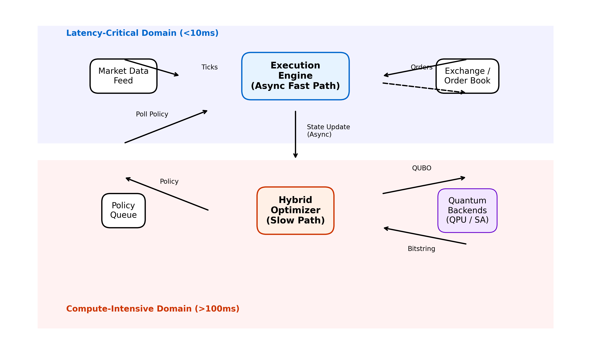

# Hybrid Quantum-Classical Trading Execution System


A research-grade hybrid architecture for optimal trade execution, combining low-latency classical execution with quantum-inspired optimization (QUBO/QAOA) to minimize implementation shortfall.



##  Key Features

*   **Hybrid Architecture**: Decoupled "Fast Path" (Execution Engine, <10ms delay) and "Slow Path" (Quantum/Classical Optimizer, 1-5s update).
*   **Asynchronous Optimization**: Trading never blocks; execution policy is updated in real-time via a thread-safe queue.
*   **Quantum Solvers**: Supports Simulated Annealing (SA) and QAOA (via Qiskit).
*   **Real Data Ready**: Includes `qexec.market.loader.DataLoader` for NSE/Binance/NYSE tick data ingestion and backtesting.
*   **Real-Time Dashboard**: Streamlit interface for live monitoring, strategy comparison, and quantum visualization.
*   **Robustness**: Built-in resilience against solver timeouts and crashes with exponential backoff and classical fallback.
*   **Advanced Analytics**: Implementation Shortfall decomposition (Delay, Impact, Timing Risk).

##  System Requirements

*   **OS**: Windows 10/11, Linux (Ubuntu 20.04+), or macOS (M1/Intel).
*   **Python**: Version 3.10 or higher.
*   **RAM**: Minimum 8GB (16GB recommended for heavy simulations).
*   **CPU**: Multi-core processor (Hybrid engine is multi-threaded).
*   **Optional**:
    *   **GPU**: For Qiskit Aer GPU support (CUDA 11+).
    *   **IBMQ Account**: For running on real Quantum Hardware.

##  Installation

```bash
# Clone repository
git clone https://github.com/Quantum-Blade1/Hybrid-Quantum-Classical-Optimal-Execution-Engine-for-Low-Latency-Trading.git
cd Hybrid-Quantum-Classical-Optimal-Execution-Engine-for-Low-Latency-Trading

# Install dependencies (requires Python 3.10+)
pip install -e ".[dev]"          # core + test/lint tools
pip install -e ".[app]"          # Streamlit dashboard (streamlit, plotly)
pip install -e ".[hardware]"     # IBM Quantum hardware runs (qiskit-ibm-runtime)
```

Dependencies are declared in `pyproject.toml`. The library is the `qexec` package under `src/`; experiment and example scripts import it, so install it first and run the scripts from the repository root (figure and result paths are relative to it).

##  Quick Start

### 1. Interactive Dashboard (Recommended)
Launch the real-time control center:
```bash
streamlit run apps/dashboard.py
```
*Features: Live P&L, Execution Trajectory, Quantum Heatmap, TWAP Benchmark.*

### 2. Examples
Short scripts showing the library API:
```bash
python examples/vwap_twap_execution.py   # classical baselines through the ExecutionEngine
python examples/qubo_solvers.py          # build the execution QUBO; exact vs SA vs greedy
python examples/qubo_vs_baselines.py     # QUBO-optimised schedule vs VWAP/TWAP
python examples/hybrid_runtime.py        # fast/slow-path runtime and the HFT pipeline
```

### 3. Experiments
Each script in `experiments/` regenerates one set of results:
```bash
python experiments/solver_benchmark.py    # BF / SA / QAOA-simulator comparison on random QUBOs
python experiments/qaoa_vs_sa.py          # QAOA vs simulated annealing on a 12-variable execution QUBO
python experiments/ac_comparison.py       # SA-QUBO schedule vs Almgren-Chriss trajectory
python experiments/is_comparison.py       # implementation-shortfall decomposition, VWAP vs TWAP
python experiments/stress_test.py         # stress scenarios, VWAP vs hybrid
python experiments/load_test.py           # throughput of concurrent HybridController orders
python experiments/journal_figures.py     # paper figures -> paper/figures/
python experiments/hardware_benchmark.py  # SA + QAOA (ideal/noisy Aer; IBM hardware if credentials are set)
```
The walk-forward backtest (`qexec.analysis.walk_forward`) is run by `journal_figures.py` (fig21). `hardware_benchmark.py --simulator-only` skips IBM hardware; with credentials (`IBM_QUANTUM_TOKEN`, or `IBM_CLOUD_API_KEY` + `IBM_CLOUD_CRN`) every hardware job's ID and raw counts are appended to `results/hw_jobs.jsonl` as soon as it returns.

##  System Architecture

The system operates on two timescales:
1.  **Fast Loop (100ms)**: The `ExecutionEngine` consumes tick data and executes orders based on the current *Execution Policy*.
2.  **Slow Loop (1s+)**: The `HybridController` aggregates market state, formulates a QUBO problem, solves it (SA/Quantum), and pushes a new *Execution Policy*.

##  Benchmarks & Results

| Metric | VWAP | TWAP | Hybrid (Quantum) |
| :--- | :--- | :--- | :--- |
| **Market Impact** | High | Medium | **Low** |
| **Timing Risk** | Low | Low | **Low** |
| **Robustness** | Low | High | **High** |

*Qualitative comparison only. See `docs/CLAIMS_AUDIT.md` for the status of every quantitative claim.*

##  Project Structure

```
Hybrid-Quantum-Classical-Optimal-Execution-Engine-for-Low-Latency-Trading/
├── src/qexec/             # Library (import-only; no scripts)
│   ├── market/            # simulator, order_book, loader
│   ├── execution/         # engine + strategies/ (base, twap, vwap, almgren_chriss, qubo)
│   ├── optimization/      # qubo, hft_qubo, ising, schedule, solvers/ (exact, annealing, greedy, qaoa)
│   ├── microstructure/    # kyle, vpin, adverse_selection, queue, analyzer, regime
│   ├── runtime/           # policy, optimizer, engine, controller, hft_pipeline, decision, resilience, latency
│   ├── hardware/          # ibm (IBM Quantum runtime access), mitigation
│   └── analysis/          # shortfall, walk_forward, stress, runners
├── experiments/           # Runnable scripts that produce results and figures
├── examples/              # Short scripts demonstrating the library
├── apps/dashboard.py      # Streamlit dashboard
├── results/               # Benchmark data (JSON), incl. IBM hardware runs
├── paper/                 # Manuscript (main.tex) and figures/
├── docs/                  # MATHEMATICAL_MODEL.md, CLAIMS_AUDIT.md
├── assets/                # README images
├── tests/                 # Unit tests
└── pyproject.toml     # Project metadata and dependencies
```

##  License
Apache License 2.0. See `LICENSE`.
